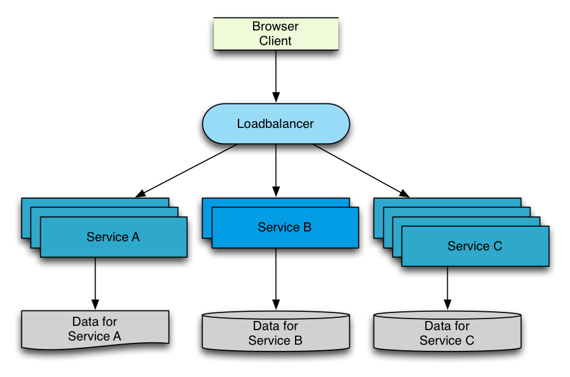

# Scaling Apache Tomcat in a Docker-based infrastructure

* [<andreas.schmidt@cassini.de>](mailto:andreas.schmidt@cassini.de)  |  @aschmidt75
* [<peter.rossbach@bee42.com>](mailto:peter.rossbach@bee42.com)  |  @PRossbach
---
## What we like to show ...

  * Test the newest kid on the IT-block
  * Construct a microservice environment form scratch
    - build a simple version
    - understand the pieces
  * Construct a time slot of real IT-fun!

---
### Microservice

  * **Microservice** means to
    - develop a single,
    - small,
    - meaningful functional feature as single service.
    - Each service has its own process
    - and communicates with lightweight mechanisms,
    - deployed on single or multiple servers.
***
[Microservice Architecture – A Quick Guide](http://www.javacodegeeks.com/2014/06/microservice-architecture-a-quick-guide.html)
-
### Why Microservices? -*1*

A Microservices ..

  * is small and focused on a specific feature / business requirement.
  * can be developed independently by small team of developers (~ 2 to 5 dev's).
  * is loosely coupled: services are independent, both in terms of development and deployment.
  * can be developed using different programming languages (Personally I don’t suggest to do it).
  * allows a easy and flexible way to integrate automatic deployment with Continuous Integration tools (for e.g: Jenkins, Hudson, bamboo etc..).
  * The productivity of a new team member will be quick enough.
-
### Why Microservices? -*2*

A Microservice

  * is easy to understand, modify and maintain for a developer because separation of code,small team and focused work.
  * allows you to take advantage of emerging and latest technologies (framework, programming language, programming practice, etc.).
  * has code for business logic only, no mixup with HTML,CSS or other UI component.
  * is easy to scale based on demand.
  * can be deployed on commodity hardware or low / medium configuration servers.
  * easy to integrate 3rd party service.
  * has its own storage capability but it depends on the projects requirement, you can have common database like MySQL or Oracle for all services.
-
### Microservice Disadvantages

  * Microservice architecture brings a lot of operations overhead.
  * DevOps Skill required (http://en.wikipedia.org/wiki/DevOps).
  * Duplication of Effort.
  * Distributed System is complicated to manage.
  * Difficult to trace problem because of distributed deployment.
  * Complicated to manage whole products when number of services increase.

---
## Microservice - Scale Cube


***
[ScaleCube](http://microservices.io/articles/scalecube.html)
-
### Definition of the axis

  * **X-axis scaling**
    - X-axis scaling consists of running multiple copies of an application behind a load balancer
  * **Y-axis scaling**
    - Unlike X-axis and Z-axis, which consist of running multiple, identical copies of the application
    - Y-axis axis scaling splits the application into multiple, different services.
    - Each service is responsible for one or more closely related functions.
  * **Z-axis scaling**
    - When using Z-axis scaling each server runs an identical copy of the code.
-
### Example Architectur



---
### Construct and build it on top of docker

  * Use an Apache Tomcat to build you app -- `hello world service ABC`
  * Build a loadbalancer with apache httpd and mod_jk
  * Build docker container for all parts
  * Manage scalability with a service discovery (ETCD)
  * Improve, make it better.

---
## Start apache installation based upon a fresh container

Start demo vm and connect to it

using vagrant:
```bash
$ vagrant up
$ vagrant ssh
```

OR - log in using virtual box and demo/demo account

***
-
Verify vm status
```bash
$ cd /data/mnt/spec.d/

$ sudo rake spec
....
Finished in 0.7392 seconds
50 examples, 0 failures
```

-
Create a fresh container

```bash
$ docker run -ti -v /data/packages:/mnt ubuntu /bin/bash
root@26936f69cc5b:/#
```
***
Installation __step by step__

-
### contents of `/data/packages`
```bash
$ ls /data/packages
apache2_2.4.7-1ubuntu4.1_amd64.deb
apache2-bin_2.4.7-1ubuntu4.1_amd64.deb
apache2-data_2.4.7-1ubuntu4.1_all.deb
libapache2-mod-jk_1.2.37-3_amd64.deb
libapr1_1.5.0-1_amd64.deb
libaprutil1_1.5.3-1_amd64.deb
libaprutil1-dbd-sqlite3_1.5.3-1_amd64.deb
libaprutil1-ldap_1.5.3-1_amd64.deb
libasn1-8-heimdal_1.6~git20131207+dfsg-1ubuntu1_amd64.deb
libgssapi3-heimdal_1.6~git20131207+dfsg-1ubuntu1_amd64.deb
libhcrypto4-heimdal_1.6~git20131207+dfsg-1ubuntu1_amd64.deb
libheimbase1-heimdal_1.6~git20131207+dfsg-1ubuntu1_amd64.deb
libheimntlm0-heimdal_1.6~git20131207+dfsg-1ubuntu1_amd64.deb
libhx509-5-heimdal_1.6~git20131207+dfsg-1ubuntu1_amd64.deb
libkrb5-26-heimdal_1.6~git20131207+dfsg-1ubuntu1_amd64.deb
libldap-2.4-2_2.4.31-1+nmu2ubuntu8_amd64.deb
libroken18-heimdal_1.6~git20131207+dfsg-1ubuntu1_amd64.deb
libsasl2-2_2.1.25.dfsg1-17build1_amd64.deb
libsasl2-modules-db_2.1.25.dfsg1-17build1_amd64.deb
libwind0-heimdal_1.6~git20131207+dfsg-1ubuntu1_amd64.deb
libxml2_2.9.1+dfsg1-3ubuntu4.3_amd64.deb
openssl_1.0.1f-1ubuntu2.5_amd64.deb
ssl-cert_1.0.33_all.deb
```

-
### Install

Regular procedure would be `apt-get install ..`, instead we'll install directly from .deb files.
```bash
$ cd /mnt
$ dpkg -i *.deb
...
$ which apache2
/usr/sbin/apache2
```
***
  * It's fast and we don't need internet connection at install time!
  * Install a base apache with mod_jk support.
-
### check apache

```bash
$ sudo mkdir -p /var/lock/apache2 /var/run/apache2 /var/log/apache2
$ /bin/bash -c "source /etc/apache2/envvars && exec /usr/sbin/apache2 -V"
Server version: Apache/2.4.7 (Ubuntu)
Server built:   Jul 22 2014 14:36:38
Server's Module Magic Number: 20120211:27
Server loaded:  APR 1.5.1-dev, APR-UTIL 1.5.3
Compiled using: APR 1.5.1-dev, APR-UTIL 1.5.3
Architecture:   64-bit
Server MPM:     event
  threaded:     yes (fixed thread count)
    forked:     yes (variable process count)
Server compiled with....
 -D APR_HAS_SENDFILE
 -D APR_HAS_MMAP
 -D APR_HAVE_IPV6 (IPv4-mapped addresses enabled)
 -D APR_USE_SYSVSEM_SERIALIZE
 -D APR_USE_PTHREAD_SERIALIZE
 -D SINGLE_LISTEN_UNSERIALIZED_ACCEPT
 -D APR_HAS_OTHER_CHILD
 -D AP_HAVE_RELIABLE_PIPED_LOGS
 -D DYNAMIC_MODULE_LIMIT=256
 -D HTTPD_ROOT="/etc/apache2"
 -D SUEXEC_BIN="/usr/lib/apache2/suexec"
 -D DEFAULT_PIDLOG="/var/run/apache2.pid"
 -D DEFAULT_SCOREBOARD="logs/apache_runtime_status"
 -D DEFAULT_ERRORLOG="logs/error_log"
 -D AP_TYPES_CONFIG_FILE="mime.types"
 -D SERVER_CONFIG_FILE="apache2.conf"
```

-
### configure apache mod_jk support

We need to add a JkMount instruction:

`JkMount /* loadbalancer`

```bash
$ F=/etc/apache2/sites-enabled/000-default.conf
$ sed -i \
 's/<\/VirtualHost>/\n\tJkMount \/* loadbalancer\n<\/VirtualHost>/g' $F
```
-

## workers.properties

We have to replace this config because it is wrong :)

```bash
root@26936f69cc5b:/# grep -v '#' /etc/libapache2-mod-jk/workers.properties | sed '/^$/d'
workers.tomcat_home=/usr/share/tomcat6
workers.java_home=/usr/lib/jvm/default-java
ps=/
worker.list=ajp13_worker
worker.ajp13_worker.port=8009
worker.ajp13_worker.host=localhost
worker.ajp13_worker.type=ajp13
worker.ajp13_worker.lbfactor=1
worker.loadbalancer.type=lb
worker.loadbalancer.balance_workers=ajp13_worker

```

***
Press CRTL-P -> CRTL-Q to leave container


-
### Add on Demo VM:

Config and logs for our apache container will reside on a host volume (not within
container).

So we need some default directories and files to exist, otherwise Apache does not start.

```bash
$ cd /data
$ mkdir apache2-jk-config
$ mkdir apache2-log
$ cd apache2-jk-config/
$ touch workers.properties
```

---
### Commit

Use `docker commit` to create an image from installed apache httpd container

```bash
$ ID=$(docker ps -l | awk '/^[0-9a-f]/{print $1}')
$ echo $ID
26936f69cc5b

$ docker commit $ID apache2:0.1
0a5a66dd5ae876b6e01ce454c4c3679d32b42980ffd97b42a2572fbb41b580f5

$ docker images | grep apache2
apache2  0.1 0 a5a66dd5ae8 25 seconds ago 209.4 MB
...
```
-
### clean up

We don't need our intermediate install container anymore:

```bash
docker stop $ID
docker rm $ID
```

---
## Start apache from newly created image

```bash
$ F_HOST=/data/apache2-jk-config/workers.properties
$ F_CONT=/etc/libapache2-mod-jk/workers.properties
$ docker run -ti --rm \
 -v $F_HOST:$F_CONT \
 apache2:0.1 /bin/bash
```

***
Inside container: check apache2 config

```bash
$ ls -al /etc/libapache2-mod-jk/workers.properties
...
$ grep -i jkmount /etc/apache2/sites-enabled/000-default.conf
JkMount /* loadbalancer
$ exit
```

-
## start the apache container

```bash
$ docker run -d -ti \
 -v /data/apache2-jk-config/workers.properties:/etc/libapache2-mod-jk/workers.properties \
 -v /data/apache2-log/:/var/log/apache2/ \
 -p 127.0.0.1:6000:80   \
 --name apache2 \
 apache2:0.1 \
 /bin/bash -c \
 "source /etc/apache2/envvars && exec /usr/sbin/apache2 -D FOREGROUND"

9794b009031d844bbb11fcea75d29a48dc79d1019e68a4610dfaea98499289d4

```

-
## First check

```bash
$ wget -O - http://0.0.0.0:6000/status
 --2014-10-01 17:22:34--  http://0.0.0.0:6000/status
 Connecting to 0.0.0.0:6000... connected.
 HTTP request sent, awaiting response... 500 Internal Server Error
 2014-10-01 17:22:34 ERROR 500: Internal Server Error.
```

***
OK, we did not yet configure and start our tomcat backends...

```bash
$ docker stop apache2
```
---
### Service Discovery with etcd and Registrator to scale out!


  * [etcd](https://github.com/coreos/etcd)
  * [registrator](https://github.com/progrium/registrator)

-
### Start etcd + registrator on your docker host

Check setup, etcd and registrator need to be running:

```bash
$ ps -ef |grep etcd
root      4248     1  0 17:30 ?        00:00:00 /usr/local/bin/etcd -v
...
$ ps -ef |grep registrator
root      4312     1  0 17:33 ?        00:00:00 /usr/local/bin/registrator etcd:///tomcat8
...
$ etcdctl ls /
/tomcat8
```

Also viable, because it is contained in our spec:
```bash
$ ( cd /data/mnt/spec.d && sudo rake spec )
```

***
In case of errors:

```bash
$ /usr/local/bin/start_etcd.sh
$ /usr/local/bin/start_registrator.sh
```


-
### looking at the scripts ...


```bash
$ cat /usr/local/bin/start_etcd.sh
sudo su - -c "killall etcd; /usr/local/bin/etcd \
 -v >/var/log/etcd.log 2>&1 &"

$ cat /usr/local/bin/start_registrator.sh
sudo su - -c "killall registrator; /usr/local/bin/registrator \
 etcd:///tomcat8 >/var/log/registrator.log 2>&1 &"
```

---
## Start apache tomcat example

 * create status webapp
 * start tomcat container
 * register tomcat container
 * check loadbalacing via apache httpd
 * start another one

-
### build test status webapp

```bash
$ cd /data/mnt/docker.d/status
$ ./build.sh
$ docker ps -l
CONTAINER ID        IMAGE                     COMMAND             CREATED             STATUS                     PORTS               NAMES
c04254e1715d        rossbachp/status:latest   "/bin/sh -c true"   6 seconds ago       Exited (0) 6 seconds ago                       status
```
***
App reported version of Tomcat, hostname and current date.

-
### start apache tomcat 8 container


```bash
$ docker run -tdi \
 -e "SERVICE_NAME=app" \
 --volumes-from status:ro \
 -P rossbachp/tomcat8

e2e2404b36ceb8226e0c723d18b7ea4a6d92134a79d042a6308fe4d36aea2503
```

Registrator will recognize this and inject data into etcd

```bash
$ etcdctl ls /tomcat8/app
/tomcat8/app/docker-workshop:goofy_meitner:8080
/tomcat8/app/docker-workshop:goofy_meitner:8009
```

Given a key for Port 8009 (the ajp13 connector), we'll ask etcd:

```bash
$ etcdctl get /tomcat8/app/docker-workshop:goofy_meitner:8009
127.0.1.1:49153
```

***
[check Dockerbox tomcat 8 project](https://github.com/rossbachp/dockerbox/tree/master/docker-images/tomcat8)

-
### Design of rossbachp/tomcat8 docker image


***
You can deploy your own webapps and tomcat extended library with local volumes. Better alternative: by using a docker data container.

[rossbachp/tomcat8 project](https://github.com/rossbachp/dockerbox/tree/master/docker-images/tomcat8)

-
## Goals

  * use minimal ubuntu and java8 base images (work in progress)
  * inject libs and .wars as volumes (hence the data container)
  * deploy manager app and generate password at start
  * clean up installation, remove examples and unused `*.bat`, .. files.
  * squash footprint and clean up build artefacts

-
## Goals (contd.)

  * use a nicer access log pattern :-)
  * use a cleaned up server.xml without comments
    * use separate executor
    * setup HTTP (8080) and AJP (8009) connectors and expose ports
    * currently do not support APR Connectors or configure other then standard NIO
  * reuse existing cool ideas from other nice people. Many thanks ;)


---
### workers.properties

We need to create a worker.properties file to access tomcat from httpd.

At the VM:

```bash
$ cd /data/mnt/dynupd

$ ./gen-modjk-workers-etcd-registrator.sh
$ cat /data/apache2-jk-config/workers.properties

$ docker restart apache2
```

-
### check status

```
$ curl http://127.0.0.1:6000/status/index.jsp
<html>
<body>
<h1>Docker Tomcat Status page</h1>

<ul>
  <li>Hostname : a222c4e3f231</li>
  <li>Tomcat Version : Apache Tomcat/8.0.11</li>
  <li>Servlet Specification Version : 3.1</li>
  <li>JSP version : 2.3</li>
  <li>Now : 2014/10/02 17:38:32</li>
</ul>
</body>
</html>
```

***
Yep, successfull. Hostname == container ID
-
### Start another one

```bash
$ docker run -tdi -e "SERVICE_NAME=app" --volumes-from status:ro \
 -P rossbachp/tomcat8

$ docker ps | grep tomcat8
f7609e148ad1        127.0.0.1:5000/rossbachp/tomcat8:201408281657-squash   "/opt/tomcat/bin/tom   5 seconds ago       Up 4 seconds        0.0.0.0:49155->8080/tcp, 0.0.0.0:49156->8009/tcp   sick_davinci
e2e2404b36ce        127.0.0.1:5000/rossbachp/tomcat8:201408281657-squash   "/opt/tomcat/bin/tom   17 minutes ago      Up 17 minutes       0.0.0.0:49153->8009/tcp, 0.0.0.0:49154->8080/tcp   goofy_meitner

$ cd /data/mnt/dynupd
$ ./gen-modjk-workers-etcd-registrator.sh
$ cat /data/apache2-jk-config/workers.properties
$ docker restart apache2
```

-
## check loadbalancing

```bash
$ curl http://127.0.0.1:6000/status/index.jsp
...
  <li>Hostname : e2e2404b36ce</li>
...
```

```bash
$ curl http://127.0.0.1:6000/status/index.jsp

  <li>Hostname : f7609e148ad1</li>
...
```

Optionally, in another shell:
```bash
$ watch 'curl http://127.0.0.1:6000/status/index.jsp'
```

-
### Continue watching, update config to bring in/take out workers

** PLEASE: Open up another shell **

```bash
$ cd /data/mnt/dynupd
$ ./watch.sh
```

Start another tomcat and check using curl!
```bash
$ docker run -tdi -e "SERVICE_NAME=app" \
 --volumes-from status:ro -P rossbachp/tomcat8
```

Stop one of the tomcats and check again!
```bash
$ docker stop <tomcat container id>
```
---
### It needs tuning..

  * better mod_jk config
  * apache graceful restart

-
### Better mod_jk support

  * switch watch.sh off!
  * look at `get_modjk-workers-ectd-registrator-elegant.sh`
  * open the container and config mod_jk
    - patch
  * commit new image apache2 again and start
  * switch to `get_modjk-workers-ectd-registrator-elegant.sh`
-
### add jkstatus mapping

.. by entering a running container via `docker-enter`!

```bash
$ sudo /bin/bash
$ docker-enter <apache container-id> /bin/bash`
$ CF=/etc/apache2/sites-enabled/000-default.conf
$ sed -i 's/<\/VirtualHost>/\n\tJkMountCopy ON\n<\/VirtualHost>/g' $CF

$ JK=/etc/apache2/mods-enabled/jk.conf
$ sed -i 's/Allow from 127.0.0.1$/Allow from 127.0.0.1 172.17.42.1/g' $JK
$ exit
```
-
### gracefully restart apache

```bash
$ ID=$(docker ps | grep apache2 | awk '/^[0-9a-f]/{print $1}')
$ sudo docker-enter $ID /bin/bash

$ /bin/bash -c \
 "source /etc/apache2/envvars && exec /usr/sbin/apachectl graceful"
```

Check jk-status at your docker-workshop host

```bash
$ curl -s http://127.0.0.1:6000/jk-status?mime=prop | grep address
worker.goofy_meitner.address=172.17.42.1:49153
worker.sick_davinci.address=172.17.42.1:49156
```
-
### Commit changes in apache image

```bash
$ ID=$(docker ps | grep apache2 | awk '/^[0-9a-f]/{print $1}')
$ echo $ID
9794b009031d
$ docker stop $ID
$ docker commit $ID apache2:0.2
0a5a66dd5ae876b6e01ce454c4c3679d32b42980ffd97b42a2572fbb41b580f5
$ docker images | grep apache2
apache2  0.2  ae7da438a1ba  9 seconds ago  209.4 MB
...
```

-
## Restart apache2
```bash
$ ID=$(docker ps | grep apache2 | awk '/^[0-9a-f]/{print $1}')
$ docker stop $ID
$ docker rm $ID
$ docker run -d -ti \
 -v /data/apache2-jk-config/workers.properties:\
 /etc/libapache2-mod-jk/workers.properties \
 -v /data/apache2-log/:/var/log/apache2/ \
 -p 127.0.0.1:6000:80   \
 --name apache2 \
 apache2:0.2 \
 /bin/bash -c \
 "source /etc/apache2/envvars && exec /usr/sbin/apache2 -D FOREGROUND"
```


***
FIN

---
## Possible optimizations

  * install log and config at separate docker data scratch container
  * use external accessible network interfaces.
  * build a watcher image/container
  * of course: use a Dockerfile to build images :-)
    * httpd
    * watcher
    * ectd
    * registrator
    * setup log volumes or install logstash-forwarder
  * add jkstatus to the config
  * optimize worker.properties generation
  * check nsenter graceful httpd restart

***
It´s up to you!

---
## Summary

  * Autoscaling is easy, but probably very specific to your environment
  * Fun power pack. Low barrier for trying out things.
  * Good old admin knowledge, combined with "new infrabricks"
  * Build an autoscaling service entrypoint with apache mod_jk is nice!
  * Autofailover service needs watching jk-status and update etcd.
  * Backend access control can also easly build with haproxy and ectd.
  * Real orchestration to coordinate process, resources, security and network access need more attention.
    - Check [CoreOS](http://www.coreos.com) or [Google Kubernetes](https://github.com/GoogleCloudPlatform/kubernetes)!

***
Many Thanks for following!

Andreas & Peter


follow our blog [infrabricks.de](http://www.infrabricks.de)

@PRossbach
@aschmidt75
